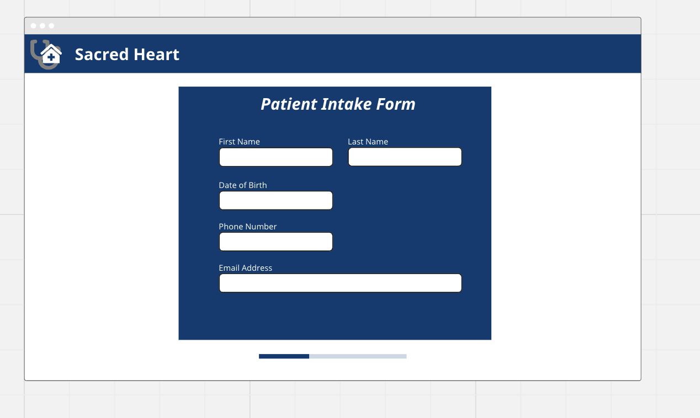
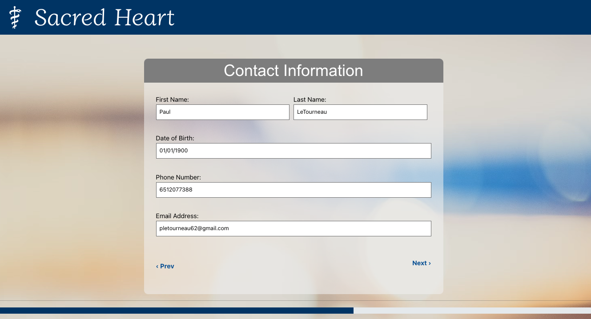

# _Physical Check-in Form_

#### By _Seth Gonzales and Paul LeTourneau_

#### _Simple check-in form for a primary care physician appointment_

## Technologies Used

- _JavaScript_
- _HTML_
- _CSS_
- _Node.js v18.17.1_
- _NPM v9.6.7_
- _React_
- _JSX_
- _Miro_
- _Firestore_

## Description

_React-based form for check-in with a primary care physician. Form is responsive and follows WCAG guidelines concerning visuals and contrast. Care was given to the choice of language to ensure plain language best practices, inclusivity, and use of non-stigmatizing language. Design was center to the execution of the site, which was wireframed prior to coding._

above wireframe of concept showing good contrast and wayfinding
below screenshot of work in progress

## Setup/Installation Requirements

- _$ git clone (https://github.com/pletourneau/KeithsJoe.git)_
- _$ cd keiths-joe_
- _$ npm install_
- _$ npm run build_
- _$ npm run start (see note)_

_{While in the root directory of the project, run `$npm install`.}_

_{If you would like to start a server when UI is added, `$ npm run start`, will open a server in your browser.}_

## Known Bugs

- _please reach out as bugs are found! thepaulletourneau@gmail.com_

## License

MIT License

Permission is hereby granted, free of charge, to any person obtaining a copy of this software and associated documentation files (the "Software"), to deal in the Software without restriction, including without limitation the rights to use, copy, modify, merge, publish, distribute, sublicense, and/or sell copies of the Software, and to permit persons to whom the Software is furnished to do so, subject to the following conditions:

The above copyright notice and this permission notice shall be included in all copies or substantial portions of the Software.

THE SOFTWARE IS PROVIDED "AS IS", WITHOUT WARRANTY OF ANY KIND, EXPRESS OR IMPLIED, INCLUDING BUT NOT LIMITED TO THE WARRANTIES OF MERCHANTABILITY, FITNESS FOR A PARTICULAR PURPOSE AND NONINFRINGEMENT. IN NO EVENT SHALL THE AUTHORS OR COPYRIGHT HOLDERS BE LIABLE FOR ANY CLAIM, DAMAGES OR OTHER LIABILITY, WHETHER IN AN ACTION OF CONTRACT, TORT OR OTHERWISE, ARISING FROM, OUT OF OR IN CONNECTION WITH THE SOFTWARE OR THE USE OR OTHER DEALINGS IN THE SOFTWARE.

Copyright (c) _2023_ _Paul LeTourneau_
